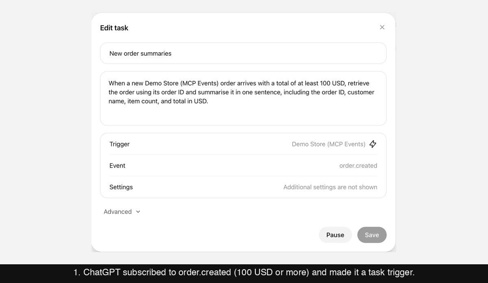
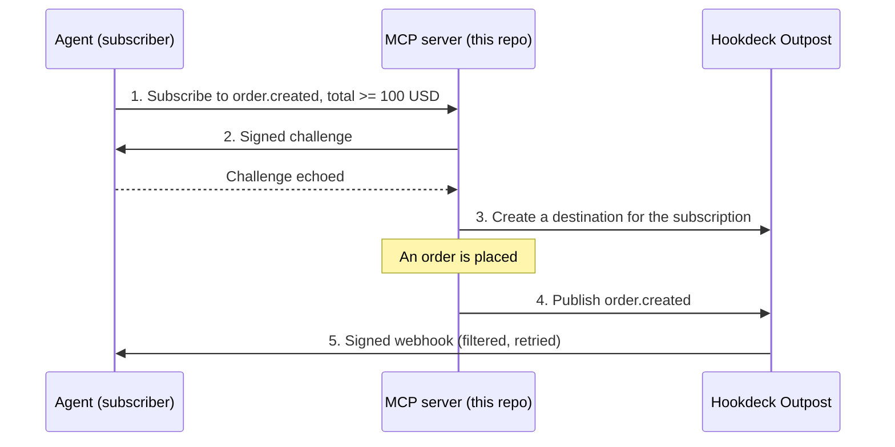
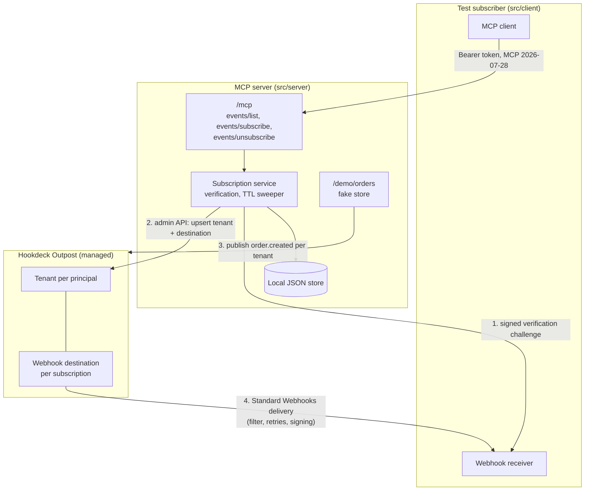
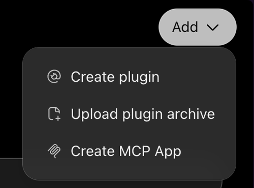
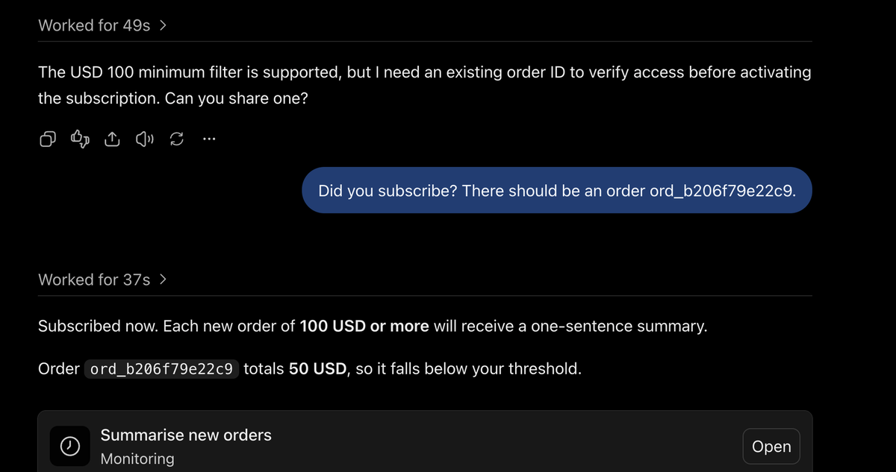
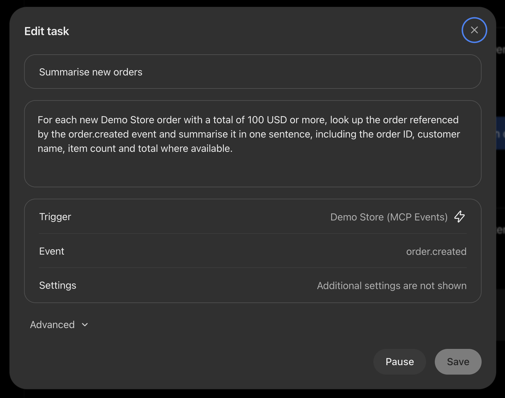
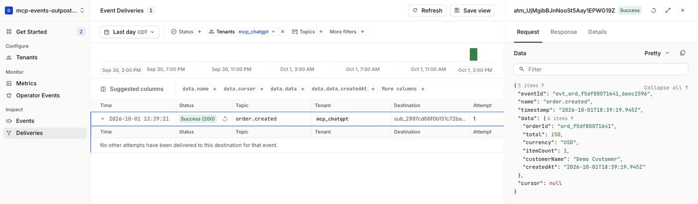
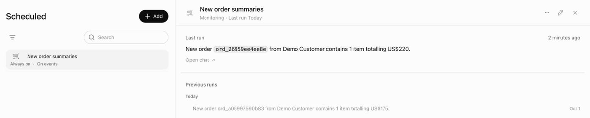

# MCP Events with Hookdeck Outpost

A working demo of an MCP server that sends [MCP Events](https://github.com/modelcontextprotocol/experimental-ext-triggers-events/blob/main/docs/design-sketch-proposal.md) webhooks, with [Hookdeck Outpost](https://hookdeck.com/docs/outpost) doing the delivery.

MCP Events is a draft MCP extension that lets an agent subscribe to things happening behind an MCP server, so it can react without a user in the loop. ChatGPT is the first real subscriber, and it uses webhook delivery only ([OpenAI's implementer guide](https://developers.openai.com/plugins/build/mcp-events)). This repo is for MCP server builders who want to offer MCP Events without building webhook delivery themselves.

**Status:** demo code, not production-ready. Tested end to end against managed Outpost, and with ChatGPT as the subscriber, on 2026-10-01. See [Known issues](#known-issues) and [What's demo-only](#whats-demo-only).



## How it works

1. **An agent subscribes.** It calls `events/subscribe` on the MCP server with the event it wants (`order.created`), optional filters (orders of 100 USD or more), a callback URL, and a signing secret it chose.
2. **The server checks the agent wants the deliveries.** It POSTs a signed challenge to the callback URL, and the agent echoes it back.
3. **The server hands the subscription to Outpost.** It creates an Outpost webhook destination with the callback URL, the secret, and a filter built from the subscription's arguments.
4. **Something happens.** When an order is placed, the server publishes one event to Outpost.
5. **Outpost delivers it.** Outpost filters, signs (Standard Webhooks), delivers, and retries. The agent verifies the signature and acts.

The agent refreshes its subscription before it expires, and unsubscribes when it's done. The server deletes the destination when either happens or the subscription lapses.



The quickstart uses a test subscriber (`src/client/`) as the agent. ChatGPT works as the subscriber too: see [Try it with ChatGPT](#try-it-with-chatgpt).

## Quickstart

### Prerequisites

- Node.js 22 or later.
- A Hookdeck account with a managed Outpost project, and an API key from the project's **Settings > Secrets**.

### 1. Install and configure

```sh
npm install
cp .env.example .env    # then set OUTPOST_API_KEY
```

### 2. Prepare your Outpost project

```sh
npm run outpost:check -- --apply
```

This turns on Standard Webhooks signing (`DESTINATIONS_WEBHOOK_MODE=standard`), adds the `order.created` topic, and sets a retry schedule within MCP Events' guidance if you don't have one. These are project-wide settings, so use a project you don't share with other webhook traffic. Run it without `-- --apply` to check without changing anything.

### 3. Run it

Outpost delivers from the internet, so the subscriber's receiver needs a public URL. The tunnel provides one. Use four terminals:

```sh
npm run tunnel                                      # 1. public URL for the receiver
npm run server                                      # 2. the MCP server
npm run client -- --min-total 100 --currency USD    # 3. the test subscriber
```

Then place some orders in a fourth terminal:

```sh
npm run order -- --total 150 --currency USD    # delivered
npm run order -- --total 20 --currency USD     # filtered out by Outpost
npm run order -- --total 500 --currency EUR    # filtered out by Outpost
```

The client output looks like this:

```text
[client] receiver listening on :4000, callback URL https://<random>.trycloudflare.com/mcp-events/...
[client] connected, protocol 2026-07-28
[client] events/list offers: order.created
[client] answered verification challenge (msg_verification_...)
[client] subscribed sub_..., refreshBefore 2026-10-01T18:33:11.306Z
[client] waiting for events. Place an order with `npm run order`. Ctrl+C to unsubscribe and exit.
[client] event order.created evt_ord_..._...: {"orderId":"ord_...","total":150,"currency":"USD",...}
```

Only the 150 USD order arrives. You can also see the destination in your Outpost project, under tenant `mcp_alice`.

### 4. Stop

Press Ctrl+C in the client. It unsubscribes, and the server deletes the destination. Then stop the tunnel and the server.

### Next: use ChatGPT as the subscriber

To have ChatGPT subscribe instead of the test client, follow [Try it with ChatGPT](#try-it-with-chatgpt). It takes a ChatGPT Plus account (or above) with Developer mode, and a second tunnel for the MCP server.

### Troubleshooting

- **`subscribe failed` with code `-32602` and `https_required`.** The client found no tunnel URL, so it used `http://localhost:4000`. Start `npm run tunnel` before the client.
- **`subscribe failed` with code `-32015`.** The server couldn't complete the verification challenge through the tunnel; `data.reason` says why (for example `http_5xx` or `connection_refused`). Check the tunnel is still running. If it was killed without exiting cleanly, `.tunnel-url` may point at a dead URL: delete it and restart the tunnel.
- **`outpost:check` reports settings that need changing.** Run it with `-- --apply`, or set them in the Hookdeck dashboard (see [Outpost project setup](#outpost-project-setup)).
- **Subscribed, but no events arrive.** Check the order matches the filters you subscribed with, and that the project is in Standard mode with the `order.created` topic.
- **`OUTPOST_API_KEY is not set`.** Copy `.env.example` to `.env` and set the key.

## Going deeper

- [Architecture](#architecture): components and the full message flow.
- [How MCP Events maps onto Outpost](#how-mcp-events-maps-onto-outpost) and [Tenancy and publishing](#tenancy-and-publishing): the design choices.
- [MCP protocol version and SDK](#mcp-protocol-version-and-sdk).
- [Configuration](#configuration): Outpost project setup, client options, environment variables.
- [Tests](#tests).
- [Known issues](#known-issues) and [What's demo-only](#whats-demo-only).
- [Outpost: what it handles and what's open](#outpost-what-it-handles-and-whats-open) and [What was verified](#what-was-verified-and-what-was-assumed-about-managed-outpost): what this demo taught us about Outpost.
- [Where the spec and OpenAI's guide differ](#where-the-spec-and-openais-guide-differ).
- [Try it with ChatGPT](#try-it-with-chatgpt): steps, results, and what ChatGPT actually sends.
- [Project layout](#project-layout).

## Architecture

- `src/server/`: the MCP server (TypeScript, official MCP SDK v2, Streamable HTTP). One event type, `order.created`, from a fake demo store.
- `src/client/`: a test subscriber. An MCP client plus a webhook receiver that answers verification challenges and verifies deliveries with the `standardwebhooks` library.
- `test/`: unit tests and an end-to-end test that runs the whole flow offline against a mock Outpost.



The full message flow, including refresh and unsubscribe:

```mermaid
sequenceDiagram
    autonumber
    participant C as Subscriber
    participant S as MCP server
    participant O as Outpost
    C->>S: events/subscribe {name, arguments, delivery: {url, secret}, ttlMs}
    S->>C: POST {"type":"verification","challenge":"..."} (signed with the client's secret)
    C-->>S: 200 {"challenge":"..."}
    S->>O: PUT /tenants/mcp_<principal>
    S->>O: POST /tenants/{t}/destinations (id = subscription id, secret, filter, X-MCP-Subscription-Id header)
    S-->>C: {id, refreshBefore, cursor: null, truncated: false}
    Note over S,O: an order is placed
    S->>O: POST /publish {id: eventId, tenant_id, topic: order.created, data: MCP event envelope}
    O->>C: POST {eventId, name, timestamp, data, cursor} + webhook-id/-timestamp/-signature + X-MCP-Subscription-Id
    C-->>O: 200
    C->>S: events/subscribe (same key, before refreshBefore; optional new secret)
    S->>O: PATCH destination (expiry metadata; secret + previous_secret on rotation)
    C->>S: events/unsubscribe {name, arguments, delivery: {url}}
    S->>O: DELETE destination
```

## How MCP Events maps onto Outpost

| MCP Events | Outpost |
|---|---|
| Authenticated principal | Tenant `mcp_<principal>` (hashed when the principal isn't a simple slug) |
| Webhook subscription | Webhook destination whose `id` is the subscription id |
| Subscription id (`sub_` + 32 hex of SHA-256 over canonical `(principal, url, name, arguments)`) | Destination `id`, and the `X-MCP-Subscription-Id` value in `config.custom_headers` |
| `delivery.url` | `config.url` |
| `delivery.secret` (client-supplied) | `credentials.secret`, set through the admin API |
| Secret rotation on refresh | `credentials.previous_secret` + `previous_secret_invalid_at`, so Outpost dual-signs during the grace window |
| Event name | Topic `order.created` |
| Subscription `arguments` | Destination `filter` (`minTotal` becomes `$gte`, `currency` becomes equality) |
| Event occurrence | `POST /publish` with `id` = `eventId` and `data` = the full MCP event envelope |
| `webhook-id` = `eventId` | Outpost's Standard Webhooks mode sends the event id as `webhook-id` |
| Retries with a fresh timestamp and signature per attempt | Outpost retries |
| `deliveryStatus` on refresh | Derived from the destination's `disabled_at` and its latest attempt |

Outpost sends the published `data` as the HTTP body, unchanged. So the server publishes the whole MCP envelope `{eventId, name, timestamp, data, cursor}` as Outpost's `data`, and the delivered body is exactly what MCP Events expects. The catch is that destination filters see the envelope, so the order fields sit under `data.data`:

```json
{ "data": { "data": { "total": { "$gte": 100 }, "currency": "USD" } } }
```

The server does the parts Outpost doesn't: the verification handshake, callback URL checks, deterministic ids and idempotent upsert, and expiring subscriptions (see [What your MCP server handles](#what-your-mcp-server-handles)).

## Tenancy and publishing

Outpost's publish API takes exactly one `tenant_id`, and each principal is its own tenant. So when an order is placed, the demo store publishes one copy per tenant that has a live `order.created` subscription, and Outpost fans each copy out to that tenant's matching destinations, applying their filters. Outpost's idempotency key is the event id across the whole project, so each tenant's copy gets its own `eventId` (`evt_<orderId>_<tenant hash>`).

The more Outpost-native alternative is a single tenant for the whole MCP server, so one publish fans out to every subscription. That makes publishing O(1), but it puts every principal's subscriptions in one tenant, so you lose per-principal isolation, the tenant portal, and per-tenant metrics, and you run into `MAX_DESTINATIONS_PER_TENANT` (20 by default, in the open source build and on a new managed project; managed exposes it in the Config API). One tenant per principal is the better fit for a multi-user server like one ChatGPT connects to, and the per-tenant loop is cheap.

## MCP protocol version and SDK

- SDK: `@modelcontextprotocol/server` 2.2.0, `@modelcontextprotocol/client` 2.2.0, `@modelcontextprotocol/node` 2.1.0. This is the v2 line of the official TypeScript SDK, which replaces the monolithic `@modelcontextprotocol/sdk` package. The latest v1 (`@modelcontextprotocol/sdk` 1.31.0) does not serve the 2026-07-28 revision.
- Protocol: the server serves **2026-07-28** (what ChatGPT requires) through the SDK's `createMcpHandler`, which also answers `server/discover`. 2025-era clients fall back to the SDK's stateless legacy serving. The end-to-end test asserts that the test client negotiates `2026-07-28`.
- The SDK has no MCP Events support. The server declares `capabilities.events` (cast, because the SDK's capability type doesn't know it) and registers `events/list`, `events/subscribe`, and `events/unsubscribe` as custom request handlers. On the client side the SDK's typed `getServerCapabilities()` drops the unknown `events` key, so the test client reads `server/discover` directly.

## Configuration

### Outpost project setup

`npm run outpost:check -- --apply` does steps 2, 3, and 5 for you. To do them by hand:

1. **API key.** In the Hookdeck dashboard, open your Outpost project and go to **Settings > Secrets**. Create or copy an API key. This is `OUTPOST_API_KEY`.
2. **Topic.** Add `order.created` to the project's topics.
3. **Standard Webhooks mode.** Set `DESTINATIONS_WEBHOOK_MODE` to `standard` in [Hookdeck Destinations settings](https://dashboard.hookdeck.com/settings/project/destinations). Leave `DESTINATIONS_WEBHOOK_HEADER_PREFIX` unset (Standard mode defaults it to `webhook-`), and leave the `DESTINATIONS_WEBHOOK_DISABLE_DEFAULT_*` options off.
4. **Check it.** `npm run outpost:check` reads the managed Config API (`GET /config`) and reports both settings. With `-- --apply` it sets the ones that are missing (it appends `order.created` to your existing topics rather than replacing them).
5. **Retry schedule.** MCP Events suggests 3 to 5 attempts over no more than 10 to 15 minutes. Outpost's `RETRY_SCHEDULE` setting is a list of delays in seconds, and its length sets the number of retries. `outpost:check -- --apply` sets `30,120,600` (4 attempts within about 12.5 minutes) if no schedule is set. Without one, the managed default allows up to 10 retries.

API base URL: `https://api.outpost.hookdeck.com/2025-07-01`, authenticated with `Authorization: Bearer <API key>`. It's configurable with `OUTPOST_API_BASE_URL` (for example, to point at a self-hosted Outpost).

### The tunnel

`npm run tunnel` uses the [`cloudflared`](https://www.npmjs.com/package/cloudflared) package (a dev dependency), which downloads the `cloudflared` binary on first run. A quick tunnel needs no Cloudflare account and gets a random `https://<random>.trycloudflare.com` URL each time. The script writes that URL to `.tunnel-url` (gitignored) and removes it on exit. `npm run client` uses it when `PUBLIC_CALLBACK_URL` is empty, so there's nothing to copy. Set `PUBLIC_CALLBACK_URL` only to use a different public URL.

The MCP server itself stays on localhost; only the receiver needs to be public. To expose another port instead, for example the MCP server so ChatGPT can connect to it, pass `--port`: `npm run tunnel -- --port 3000` prints the `/mcp` URL and doesn't touch `.tunnel-url`. Run two tunnels to expose both.

### Client options

| Flag | Effect |
|---|---|
| `--min-total <n>` / `--currency <ISO>` | Subscription arguments (filters) |
| `--ttl-ms <n>` | Suggested TTL. The server grants between `SUBSCRIPTION_MIN_TTL_MS` and `SUBSCRIPTION_MAX_TTL_MS` (1 minute and 1 hour by default) |
| `--rotate-secret` | Generate a new secret on every refresh, to watch dual-signed deliveries |
| `--skip-timestamp-check` | Accept deliveries older than 5 minutes (signatures are still verified) |
| `--keep-subscription` | Don't unsubscribe on exit, to watch the sweeper remove the destination after the TTL |
| `--debug` | Log every `webhook-signature` entry and whether it matches the current secret, the previous one, or neither. With `--rotate-secret`, this shows dual-signing during the grace window and the old signature dropping out after it |

### Environment variables

Everything is documented in [`.env.example`](.env.example). `MCP_TOKENS` maps demo bearer tokens to principals (`dev-token-alice=alice,dev-token-bob=bob`).

### Without Outpost reaching you

With `ALLOW_LOCAL_CALLBACKS=true` and no tunnel, the client uses `http://localhost:4000/...` as its callback. Verification works (the server can reach localhost), but managed Outpost can't deliver to your laptop. Use this only with the mock Outpost, which is what the tests do.

## Tests

```sh
npm test            # vitest: unit + end-to-end, offline
npm run typecheck   # tsc --noEmit
```

- `test/secret.test.ts`: `whsec_` validation (24 to 64 bytes, strict base64) and generation.
- `test/identity.test.ts`: subscription id derivation (deterministic, key-order-insensitive) and tenant ids.
- `test/signing.test.ts`: signatures interoperate with the `standardwebhooks` library, including dual signatures during rotation, tampering, the 5-minute freshness window, and matching each signature entry to its secret.
- `test/callback.test.ts`: SSRF rules (special-purpose IPv4 and IPv6 ranges, https-only, connect-time blocking of loopback), and verification (echo, wrong echo, 4xx, 5xx, redirects not followed, timeout, connection refused).
- `test/events.test.ts`: argument validation and argument-to-filter mapping, evaluated the way Outpost evaluates filters.
- `test/tunnel-url.test.ts`: the `.tunnel-url` file the client reads when `PUBLIC_CALLBACK_URL` is empty.
- `test/e2e.test.ts`: the MCP server, the test subscriber, and `test/mock-outpost.ts` (a small HTTP server implementing the Outpost endpoints the demo calls, which signs and delivers like Outpost's Standard Webhooks mode, retries every non-2xx, and evaluates filters). It proves subscribe, challenge, publish, signed delivery, verification, filtering, dedup, forged and stale rejection, refresh with secret rotation and dual-signing, unsubscribe, the sweeper, idempotent upsert, and the JSON-RPC error codes (`-32602`, `-32011`, `-32014`, `-32015`).

## Known issues

- **Secret rotation on a busy destination.** On managed Outpost, if a destination gets a delivery at least once a minute, deliveries keep being signed with the old secret after a rotation, until the destination is idle for a minute. A subscriber that rotates twice in that time stops accepting deliveries. Fixed in Outpost by [#1085](https://github.com/hookdeck/outpost/pull/1085), not yet released or deployed to managed. Details in [Open Outpost issues](#open-outpost-issues), item 2.

## What's demo-only

- **Bearer token auth.** `MCP_TOKENS` maps static tokens to principals, for the test client. A real server uses OAuth, with the token's subject as the principal (see [Auth: what this demo skips](#auth-what-this-demo-skips)).
- **`ANONYMOUS_PRINCIPAL`.** Lets requests with no token act as one fixed principal, for probing clients that don't do OAuth yet. Anyone who can reach the server can then subscribe as that principal. Leave it empty outside a short test.
- **Local JSON store** (`data/subscriptions.json`). Fine for one process. It holds subscription metadata and a hash of each secret; the secrets themselves live only in Outpost. A real server would use a database.
- **`ALLOW_LOCAL_CALLBACKS`.** Allows `http://` and private or loopback callback addresses. Never enable it on a server that is reachable from the internet.
- **No replay.** `cursor` is always `null` and missed events can't be recovered through the protocol. If a client supplies a non-null cursor the server returns `truncated: true`.
- **No `ttlMs: null` grants.** A request for no expiry gets the default finite TTL, which the sketch allows.
- **`/demo/orders` is unauthenticated** and the orders live in memory.
- **The verification cache is in memory**, so a restart re-verifies on the next subscribe. Verification POSTs are not rate-limited per host.

## Outpost: what it handles and what's open

Running MCP Events on Outpost splits the work three ways: what Outpost does as the delivery layer, what the platform running Outpost provides, and what the MCP server does because it's specific to MCP Events. Only the last group of items below are asks of Outpost itself. Findings come from Outpost's source (`main` as of 2026-10-01), its OpenAPI spec, and live tests against a managed project (see [What was verified](#what-was-verified-and-what-was-assumed-about-managed-outpost)).

### What Outpost handles

- **Signing:** Standard Webhooks mode with admin-set `whsec_` secrets, `webhook-id` equal to the event id and stable across retries, and a fresh timestamp and signature on every attempt.
- **Secret rotation:** dual-signing with `previous_secret` (`v1,<new> v1,<old>`) until `previous_secret_invalid_at` (but see [the rotation issue](#open-outpost-issues) below).
- **Filtering:** destination filters evaluate the subscription's `arguments`, so non-matching events are never sent.
- **Per-subscription destinations:** caller-chosen destination ids (the subscription id) and per-destination custom headers (`X-MCP-Subscription-Id`).
- **Retries and logs:** a configurable retry schedule, and delivery attempts you can query and inspect in the dashboard.

Outpost also sends `webhook-topic` (and any publish `metadata`) as headers. That's harmless: the MCP delivery profile only requires the four headers it lists.

### What your MCP server handles

These are specific to MCP Events or easy for the server to own. The demo implements each one in [`src/server/subscriptions.ts`](src/server/subscriptions.ts) and [`src/server/callback.ts`](src/server/callback.ts).

- **The endpoint verification challenge.** MCP Events requires proving the endpoint wants deliveries before activating a subscription, and the challenge format and echo rules are MCP-specific. The server also has to return `-32015 CallbackEndpointError` synchronously from `events/subscribe`. So the server sends the signed `verification` challenge itself and only then creates the destination.
- **Subscription expiry.** Subscriptions are TTL-scoped and refreshed by the client. The server runs a sweeper (`SWEEP_INTERVAL_MS`, 30 seconds by default) that deletes expired destinations. An expired subscription can still receive an event until the sweep runs; a destination `expires_at` in Outpost would close that window, but it isn't needed.
- **Fan-out across principals.** Outpost's publish API takes one `tenant_id` and its event ids are idempotency keys across the whole project, so the server publishes one copy per tenant with a live subscription, each with its own event id (see [Tenancy and publishing](#tenancy-and-publishing)).
- **`deliveryStatus` on refresh.** Assembled from the destination's `disabled_at` and its latest attempt. If `ALERT_AUTO_DISABLE_DESTINATION` is on, a refresh re-enables the destination, which matches the spec's "a successful refresh reactivates delivery".
- **Callback URL checks at subscribe time** (https only, public addresses, no redirects) on the subscribe and verification requests.
- **Poll mode, if you want it.** Outpost only stores events that matched a destination, so an `events/poll` implementation should keep its own event log. ChatGPT doesn't use poll, and this demo doesn't implement it.

### What the platform running Outpost handles

- **Delivery-time SSRF protection.** MCP Events wants the delivery path to block non-public addresses at connect time and never follow redirects. An MCP server can't enforce that for connections Outpost makes, and Outpost's own webhook client follows redirects (Go's default, up to 10) and has no private-address blocklist. The fix is egress infrastructure: route deliveries through an SSRF-filtering proxy. Outpost [#1100](https://github.com/hookdeck/outpost/pull/1100) (merged 2026-09-30) adds `DESTINATIONS_PROXY_URL`, an HTTP CONNECT proxy for webhook, RabbitMQ, and Kafka destinations, and reports a proxy deny (for example an Envoy RBAC rule acting as the egress SSRF gate) as a `network_unreachable` attempt. It replaces the webhook-only `DESTINATIONS_WEBHOOK_PROXY_URL`, now deprecated. #1100 isn't in a release yet (the latest is v1.5.0, 2026-09-23), so it isn't available on managed Outpost as of 2026-10-01.

### Open Outpost issues

1. **`410` and `413` are retried.** Outpost retries every failed attempt while the retry budget lasts, whatever the status code (any status of 400 or above is a failed attempt, and the retry decision only checks the attempt count). MCP Events and OpenAI say `410 Gone` and `413 Payload Too Large` must not be retried. Nothing outside Outpost can stop those retries, so this needs an option to treat some status codes as final.
2. **Rotated secrets aren't picked up by a busy destination.** Found live on managed, root cause read in the source. Outpost's delivery path caches a publisher per destination, and the publisher holds the signing secrets. The cache key (`MakePublisherKey` in `internal/destregistry/registry.go`) hashes the destination id, `config`, and `type`, but not `credentials`. Entries live for `defaultPublisherTTL` (1 minute), and every cache hit resets that minute (`internal/lru/lru.go`). So after a credentials-only `PATCH`, a destination that gets at least one delivery a minute keeps signing with the old secret, indefinitely:
   - After a rotation, deliveries 15 and 35 seconds later carried one signature, from the **previous** secret only, although `GET` returned the new `secret`, `previous_secret`, and `previous_secret_invalid_at`.
   - After the cache had been idle for over a minute, the next delivery was correctly dual-signed.
   - A subscriber that rotates again while the stale publisher is still warm stops accepting deliveries: neither of its two accepted secrets is the one Outpost is still using. The MCP server can't see this happening.

   `previous_secret_invalid_at` itself is applied at signing time (`destwebhook/signature.go`), so the old signature does drop out on schedule once the publisher has the new credentials. This is [hookdeck/outpost#1084](https://github.com/hookdeck/outpost/issues/1084), fixed on `main` by [#1085](https://github.com/hookdeck/outpost/pull/1085) (merged 2026-09-28, credentials now part of the key). The latest server release, v1.5.0 (2026-09-23), predates the fix, and managed Outpost still showed the bug on 2026-10-01. Until the fix is deployed, a server-side workaround would be to change something in `config` on rotation, such as a custom header carrying a secret version, to force a new cache key; the demo doesn't do this.

3. **API sharp edges around publish idempotency.** Outpost matches destinations before checking the event id, which leaves two surprises (both reproduced on managed):
   - Publishing an event id already used (for any tenant) returns `202` with `duplicate: true` and isn't delivered, but `destination_ids` still lists the matching destinations. A caller reading only `destination_ids` would think it was delivered.
   - A publish that matched no destination doesn't record its id, so publishing the same id again later returns `duplicate: false`.
4. **The managed version isn't exposed by the API.** The dashboard shows it (v1.5.0 at the time of testing), but there's no way to check from code which fixes are live.

## What was verified and what was assumed about managed Outpost

Verified from Outpost's OpenAPI spec, docs, and Go source:

- Base URL `https://api.outpost.hookdeck.com/2025-07-01` and `Authorization: Bearer <API key>` (OpenAPI `servers`, the managed curl quickstart).
- Endpoints: `PUT /tenants/{id}`, `POST/GET/PATCH/DELETE /tenants/{id}/destinations[/{id}]`, `PUT .../enable`, `GET .../attempts`, `POST /publish` (requires `tenant_id`), `GET/PATCH /config` (managed only).
- Admin keys can set `credentials.secret`, `previous_secret`, and `previous_secret_invalid_at`; tenants can't. Standard mode requires `whsec_` + base64.
- `config.custom_headers` is a JSON string; names must be letters, digits, hyphens, or underscores and can't override `content-type`, `content-length`, `host`, `connection`, or `user-agent`.
- Filters use `simplejsonmatch` operators (`$gte`, `$eq`, `$in`, `$or`, ...) against `{id, topic, time, metadata, data}`.
- Standard mode headers and signature: `webhook-id` = event id, `webhook-timestamp`, `webhook-signature: v1,<base64 HMAC of id.timestamp.body>`, one entry per valid secret. Mode is set with `DESTINATIONS_WEBHOOK_MODE=standard` through the dashboard or Config API.
- Caller-supplied destination ids are accepted; a duplicate id returns 400 "destination already exists". Publish idempotency is keyed on the event id alone.

Verified live against managed Outpost (2026-10-01), using the admin API directly with throwaway tenants and the same destination payload the server builds. Deliveries went to an unresolvable `.invalid` host, so these checks cover the API and attempt records, not the bytes on the wire:

- `npm run outpost:check -- --apply` sets `DESTINATIONS_WEBHOOK_MODE=standard` and `TOPICS=order.created` through `PATCH /config`. A new project starts with `default` mode and no topics.
- Tenant upsert (`PUT` returns `201`), destination create with a caller-chosen `sub_...` id, `config.custom_headers` as a JSON string, `metadata`, and a `whsec_` secret that `GET` returns byte-for-byte. A duplicate id returns `400 {"message":"destination already exists"}`, which the server's idempotent upsert relies on.
- **Filters.** With `{"data":{"data":{"total":{"$gte":100},"currency":"USD"}}}`, `POST /publish` returned the destination in `destination_ids` for 150 USD and for exactly 100 USD, and returned `[]` for 20 USD and 500 EUR. Filtered-out events create no attempts. Same behavior as the mock.
- **Rotation storage.** `PATCH` with `credentials: {secret, previous_secret, previous_secret_invalid_at}` is accepted, and `GET` returns all three.
- **Attempt ordering.** `GET .../attempts` defaults to `order_by: time, dir: desc`, and `?limit=1` returns the newest attempt. Attempt `code` is a string such as `dns_error` or `connection_refused` (an HTTP status for HTTP failures). The server maps codes it doesn't recognize, including `dns_error`, to `connection_refused`.
- **Retries.** With `eligible_for_retry: true` and the managed defaults (`RETRY_INTERVAL_SECONDS=30`, `MAX_RETRY_LIMIT=10`, no `RETRY_SCHEDULE`), the second attempt came 30 seconds after the first (later attempts weren't observed). Up to 10 retries is more than the 3 to 5 attempts MCP Events suggests, so set `RETRY_SCHEDULE` (see [Outpost project setup](#outpost-project-setup), step 5).
- **Destination limit.** A new managed project has `MAX_DESTINATIONS_PER_TENANT=20`. Destination 21 returns `400 {"message":"maximum number of destinations per tenant reached"}`. That matches the server's `/maximum number of destinations/i` check, so a principal over the limit gets `-32013 ResourceExhausted` as intended (not the generic 500 the open source handler suggested).
- **Project-wide event ids**: see [Open Outpost issues](#open-outpost-issues), item 3.

Verified end to end on managed (2026-10-01), with the MCP server on localhost and the test subscriber's receiver behind a `cloudflared` quick tunnel, following the [Quickstart](#quickstart):

- The client negotiated `2026-07-28`, the server's verification challenge reached the receiver through the tunnel, and the subscription was created.
- **Standard mode delivery.** Deliveries passed the `standardwebhooks` library's signature and 5-minute freshness checks. `X-MCP-Subscription-Id` from `custom_headers` matched the subscription, `webhook-id` equaled the body's `eventId`, and the body parsed as the published envelope.
- **Filters on the wire.** 150 USD was delivered; 20 USD and 500 EUR returned `destination_ids: []` and were never sent.
- **`deliveryStatus` on refresh** carried `lastDeliveryAt` from the attempts API.
- **Rotation**, with `SECRET_ROTATION_GRACE_MS=120000`, `--rotate-secret`, and `--debug`: Outpost sends `v1,<current> v1,<previous>` (current first) during the grace window, and only `v1,<current>` after `previous_secret_invalid_at`, including from a warm cached publisher. But a busy destination doesn't pick up the rotation at all until its cached publisher expires ([Open Outpost issues](#open-outpost-issues), item 2).

Still assumed:

- Delivery-time SSRF behavior on managed Outpost (see [What the platform running Outpost handles](#what-the-platform-running-outpost-handles)).
- Retry timing beyond the second attempt, and `410`/`413` handling on managed ([Open Outpost issues](#open-outpost-issues), item 1, is from the source).
- More generally, that the rest of managed Outpost behaves like the local source checkout (last commit July 2026).

## Where the spec and OpenAI's guide differ

The demo follows OpenAI's guide where they disagree:

- **Capability shape.** The sketch shows `"events": {"listChanged": true}`; OpenAI shows `"events": {}` in the `server/discover` response. This server advertises `{}` and does not send `list_changed`.
- **Unsubscribing an unknown subscription.** The sketch says `-32011 NotFound`; OpenAI says unsubscribe is idempotent and returns `{}`. This server returns `{}`.
- **Persistence.** The sketch lets short-TTL servers keep subscriptions in memory; OpenAI asks servers to retain them across restarts. This server persists metadata to disk, and Outpost holds the destinations.
- **Control envelopes.** ChatGPT doesn't support `gap` or `terminated`, and this server doesn't send them.
- **`delivery.mode` on unsubscribe.** OpenAI includes it, the sketch doesn't; both are accepted.

## Try it with ChatGPT

ChatGPT can subscribe to this server's `order.created` event, receive deliveries from Outpost, and run a task for each one. This was tested on 2026-10-01 with a ChatGPT Plus account, using developer mode and **No Authentication**, so it's a dev-only setup: anyone with the tunnel URL can use the server. See [Auth: what this demo skips](#auth-what-this-demo-skips) for what a real server needs.

### Steps

1. Start the server with the anonymous principal and request logging:

   ```sh
   ANONYMOUS_PRINCIPAL=chatgpt LOG_MCP_REQUESTS=true npm run server
   ```

2. Expose it: `npm run tunnel -- --port 3000`. Copy the `/mcp` URL it prints.
3. In ChatGPT, go to [Plugins](https://chatgpt.com/plugins), choose **Add > Create MCP App**, paste the URL, choose **No Authentication**, and create it. This needs Developer mode (Plus or above). OpenAI's docs place the toggle under **Settings > Security and login**, but it's been seen under **Settings > Plugins**, at the bottom of the page. If **Create MCP App** appears in the **Add** menu, it's already on.

   

4. Start a **Work** chat (MCP Events don't run in plain chats), type `@`, pick the app, and ask it to subscribe, for example: "Subscribe to new orders of 100 USD or more. When one arrives, summarise the order in one sentence." ChatGPT may ask for an existing order ID first; create one with `npm run order -- --total 50 --currency USD` and give it the `orderId`.

   

   The subscription becomes a task with the MCP event as its trigger:

   

5. Place orders with `npm run order`. Each delivery shows in the Outpost dashboard under **Deliveries** (filter by tenant `mcp_chatgpt`), and the task runs appear under **Scheduled** in ChatGPT, not in the chat.

   

   
6. Delete the task in **Scheduled** to unsubscribe. Then stop the tunnel.

### Results against OpenAI's checklist

| Checklist step | Result |
|---|---|
| `server/discover` and `events/list` | Called on connect, along with `tools/list` (user agent `openai-mcp/1.0.0`) |
| Subscribe from a Work chat | `events/subscribe` with `order.created` and `{"minTotal":100,"currency":"USD"}`, mapped from the prompt |
| Callback verification | The server's signed challenge was echoed; the Outpost destination was created in tenant `mcp_chatgpt` |
| Matching event delivered with a 2xx | 150 USD order: Outpost got `200` from ChatGPT in 295 ms, first attempt |
| ChatGPT acts as instructed | The task called `get_order`, and **Scheduled** showed "Demo Customer placed order ord_... for 1 item totalling 150 USD." |
| Non-matching event not delivered | 20 USD order: filtered out by Outpost, never sent, no task run |
| Stop monitoring | Deleting the task sent `events/unsubscribe` immediately (same name, arguments, and URL, plus `delivery.mode`); the server deleted the destination |

Not tested yet: refresh before `refreshBefore` (and across a server restart), duplicates, bursts and batching, revoked access, and invalid signatures.

### What ChatGPT sends (not in OpenAI's docs)

- **Callback URL:** `https://connectors.api.openai.com/webhook/mcp-events/<32 hex>`.
- **Secret:** a `whsec_` secret of 32 bytes.
- **No `ttlMs`:** ChatGPT doesn't suggest a lifetime, so the server's `SUBSCRIPTION_DEFAULT_TTL_MS` sets how often it has to refresh.
- **`cursor: null`** on subscribe.
- **No auth needed:** MCP Events worked against a server connected with No Authentication. OpenAI's docs describe subscriptions in terms of an authenticated principal, but don't say this is required.
- **An access check before subscribing:** ChatGPT wanted to call a tool with a real resource ID (`get_order`) to "verify access" before activating the subscription, and asked the user for an order ID when it couldn't find one. The server doesn't require this; the model chose to.
- **Work chats run through Codex:** tool and event calls made from the Work chat carried the user agent `openai-mcp/1.0.0 (Codex)`.
- **Results go to Scheduled:** each delivery becomes a task run in ChatGPT's **Scheduled** view, with a link back to the chat.

### Auth: what this demo skips

This demo connects ChatGPT with **No Authentication**, which is enough to show MCP Events and Outpost working together, and it's only safe while the server is short-lived and its URL isn't shared. A real MCP server needs OAuth, so that each user is their own principal (and, here, their own Outpost tenant) and access can be revoked.

What that involves:

- **The requirements.** ChatGPT's [plugin auth guide](https://developers.openai.com/plugins/build/auth) and the MCP [authorization spec](https://modelcontextprotocol.io/specification/2026-07-28/basic/authorization) (2026-07-28): the MCP server is an OAuth resource server that publishes RFC 9728 protected resource metadata and validates token audience (RFC 8707); an authorization server issues the tokens and supports `S256` PKCE; ChatGPT registers as a client through a Client ID Metadata Document (CIMD, preferred) or dynamic client registration (DCR).
- **A stable URL.** The public `/mcp` URL becomes the token audience, so it can't change between runs. A quick tunnel won't do; use a static domain or a deployment.
- **The resource-server side is small.** The MCP SDK v2 has `requireBearerAuth`, an `OAuthTokenVerifier` interface, and helpers that serve the protected resource metadata. Verify JWTs against the authorization server's JWKS (for example with `jose`) and use the token's `sub` as the principal, where this demo uses `MCP_TOKENS`.
- **Choosing the authorization server** is the real decision:
  - **Run your own.** For example, Cloudflare's [`workers-oauth-provider`](https://github.com/cloudflare/workers-oauth-provider) in the same Worker as the MCP server, with CIMD enabled, which is how ChatGPT then registers. This avoids depending on a provider's CIMD and DCR support.
  - **Use a hosted identity provider.** OpenAI's docs link [Auth0](https://github.com/openai/openai-mcpkit/blob/main/python-authenticated-mcp-server-scaffold/README.md#2-configure-auth0-authentication) and Stytch. Check how the provider handles CIMD, DCR, and the RFC 8707 `resource` parameter before committing. Auth0, for example, needs its [Resource Parameter Compatibility Profile](https://auth0.com/ai/docs/mcp/guides/resource-param-compatibility-profile) turned on, and supports CIMD clients only by manual import.

## Project layout

```
src/
  shared/          secret validation and generation, canonical JSON, Standard Webhooks signing, tunnel URL file
  server/
    index.ts       entry point (npm run server)
    app.ts         HTTP routing: /mcp (bearer auth), /demo/orders, sweeper
    mcp.ts         MCP server: events capability, events/* handlers, get_order tool
    subscriptions.ts  subscribe, refresh, rotate, unsubscribe, sweep (Outpost-backed)
    callback.ts    callback URL rules (SSRF) and the verification challenge
    outpost.ts     minimal Outpost admin API client
    events.ts      event catalog and arguments-to-filter mapping
    identity.ts    subscription id, tenant id
    demo-store.ts  fake store that publishes order.created
    store.ts       JSON-file subscription store
    errors.ts      MCP Events JSON-RPC error codes
  client/
    index.ts       entry point (npm run client)
    subscriber.ts  MCP client + webhook receiver
scripts/
  order.ts         npm run order
  tunnel.ts        npm run tunnel (dev quick tunnel to the receiver)
  outpost-check.ts npm run outpost:check
test/              unit tests, end-to-end test, mock Outpost
```

## License

[MIT](LICENSE)
